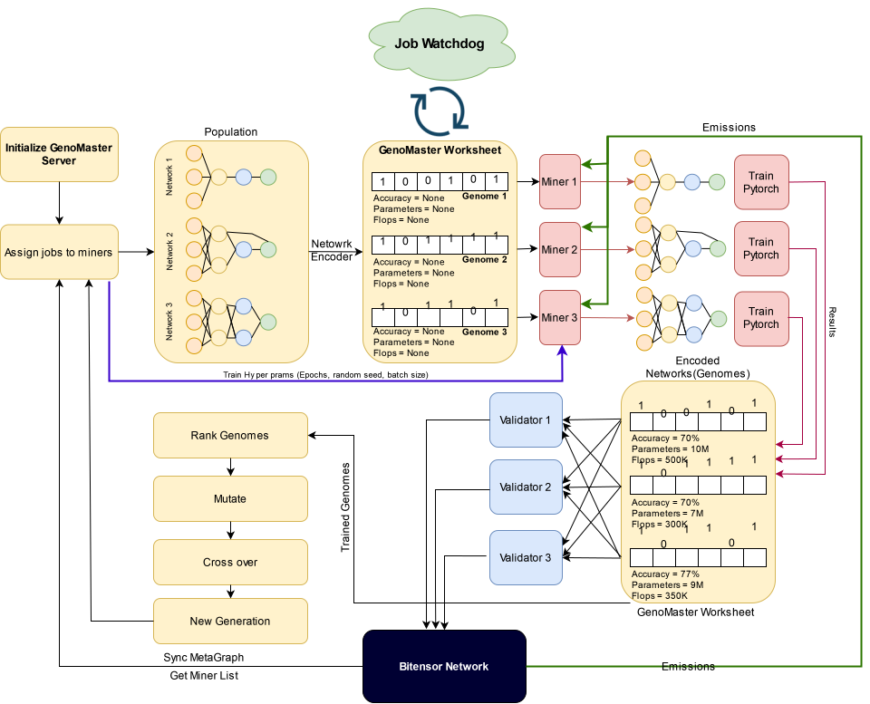
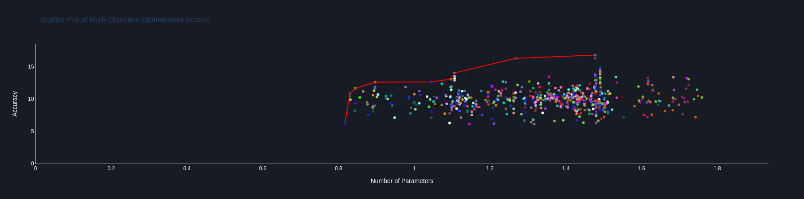
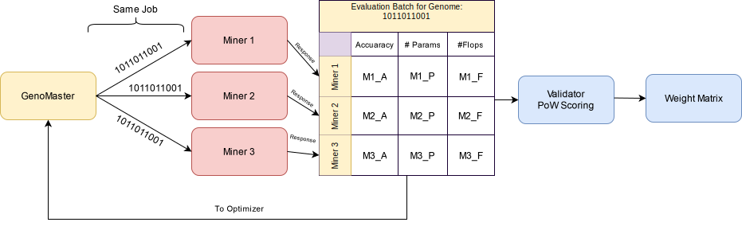

<div align="center">


---


[Discord](https://discord.gg/bittensor) • [Network](https://taostats.io/) • [Research](https://bittensor.com/whitepaper)
</div>

---
## Table of Contents

- [Introduction](#introduction)
- [How It Works](#how-it-works)
- [Hardware Requirements](#hardware-requirements)
- [Installation](#installation)
  - [Setting Up](#setting-up)
  - [Running the Miner](#running-the-miner)
  - [Running the Validator](#running-the-validator)
- [Self-Improvement Mechanism](#self-improvement-mechanism)
- [Validation and Incentive Mechanism](#validation-and-incentive-mechanism)
- [Roadmap](#roadmap)
---

## Introduction

Neural Architecture Search (NAS) is a critical field in machine learning that focuses on automating the design of artificial neural network architectures. As deep nerual network models become increasingly complex and computationally expensive, the significance of NAS grows. The primary goal of NAS is to identify the optimal model that not only maximizes accuracy for a given use-case but also minimizes the number of parameters and the computational cost, measured in Floating Point Operations (FLOPs). However, performing such searches can be very resource-intensive, often requiring days or weeks of computation on hundreds of GPUs to find an optimal model.

NASChain aims to address these challenges by leveraging the power of the Bittensor network and an innovative incentive mechanism. This approach distributes NAS tasks among participants (referred to as miners), thereby decentralizing the computational effort and potentially reducing the time and resources required for finding efficient and effective neural architectures.

---
## How it works

1. **Genetic Algorithm-Based NAS:** NASChain uses genetic algorithm for optimizing neural networks, where each network is a binary-encoded "genome". This allows for the systematic exploration of architectural possibilities.

2. **Optimization Process:** Through mutations and evaluations, NASChain refines these genomes to improve performance, aiming for the optimal blend of accuracy and efficiency across generations.

3. **Distributed Training:** Leveraging the Bittensor network, NASChain decentralizes the intensive computational process, enabling parallel genome training by a network of miners.

4. **Blockchain Integration:** This ensures security and transparency, with miners rewarded for contributing computational resources towards training and evaluating network models.

5. **Outcome:** The process yields optimal neural architectures that balance high accuracy with low computational demands, achieved more efficiently through distributed efforts.

> **The algorithm in NASChain utilizes the NSGA approach for optimization. For more insights, refer to the following resources: [paper](https://arxiv.org/abs/1810.03522) | [code](https://github.com/ianwhale/nsga-net).**
<div align="center">

</div>

### What is outcome of a NAS experimnet?
Once the NAS run is finished for a specific use case (for example, a dataset for classification), a visualization tool and a post-processing script can extract dominant genomes from the list of all genomes (circles in the plot) trained across generations. Since the NAS problem is a multi-objective optimization issue, there will be more than one optimal solution to the NAS question. All those genomes that are dominant form a Pareto optimal frontier (represented by a red line in the graph). Genomes lying on the Pareto optimal frontier can be selected as the most optimal architectures for the use case, favoring either more accuracy, a lower number of parameters, or fewer FLOPs.
<div align="center">

</div>
---

## Hardware Requirements

### Miners:
- **GPU**: Nvidia GPU with at least 16GB of memory. Note that 8GB graphics cards might work in some use cases, but their compatibility and performance are not guaranteed.

### Validators:
- **CPU**: Machines with only CPU are sufficient for validators as they do not undergo intensive computational loads.

---
## Installation

We recommend using virtual environments such as Conda to manage and isolate your project dependencies.

- Ensure you have Python >= 3.10 installed on your system.
- Both Miner and Validator code is only tested on Linux OS.
- It is advised to use a virtual environment to avoid conflicts with other projects or system-wide packages.

### Runing Miner and Validator

1. Clone the repository:
   ```bash
   git clone https://github.com/nimaaghli/NASChain
2. Navigate to the project directory:
    ```bash
    cd NASChain
3. if setting up virtual enviuuement(Skip this step if running python on system level):
    - if using conda:
        ```bash
        conda create --name myenv python=3.10
        conda activate myenv
    - if suing venv
        ```bash
        python -m venv env
        source env/bin/activate
4. Install the required packages:
    ```bash
    pip install -r requirements.txt

5. Running the miner :
    ```bash
    python neurons/miner.py --netuid 31  --wallet.name <wallet_name> --wallet.hotkey <wallet_name> --logging.debug --axon.port <your_sxon_port> --dht.port <your_dht_port> --dht.announce_ip <your_public_ip> --dht.announce_ip <your_public_ip>  --genomaster.ip http://51.161.12.128 --genomaster.port 5000
    
> **Make sure your ports for DHT and Axon are accessible from outside by setting up port forwarding.**
 
5. Running the Validator :
    ```bash
    python neurons/validator.py --netuid 31  --wallet.name <wallet_name> --wallet.hotkey <wallet_name> --logging.debug --axon.port <your_sxon_port> --dht.port <your_dht_port> --dht.announce_ip <your_public_ip> --dht.announce_ip <your_public_ip>  --genomaster.ip http://51.161.12.128  --genomaster.port 5000
---
## Self-improvement mechanism(Job Watchdog)
The subnet's self-improvement mechanism, orchestrated by the Genomaster job watchdog, initially assigns training jobs fairly across the network's neurons based on the current subnetwork metagraph. However, the process evolves dynamically based on performance:

1. **Early Completion Reassignment:** If a neuron completes its assigned jobs more quickly than its peers, it is deemed more efficient. Consequently, it is granted additional jobs that remain unfinished, particularly those initially assigned to slower-performing miners. This ensures that active, high-performance neurons are utilized to their fullest capacity without idle time.

2. **Reassignment due to Delay:** Conversely, if a miner is significantly lagging behind the average job completion time of the network, indicating underperformance or less capable hardware, the Genomaster intervenes. The underperforming miner's pending job is reassigned to a neuron that has already completed its workload and is ready for more. This intervention is carefully balanced to ensure fairness while optimizing overall network efficiency.

> **By implementing these strategies, the competition within the subnet ensures continuous improvement in the quality and speed of computations. This adaptive mechanism aims to perpetually enhance the computational quality available in the network, ensuring that resources are not just allocated efficiently, but are also in constant refinement to leverage the fastest and most capable GPUs. This dynamic optimization helps maintain the subnet's competitive edge, ensuring it continuously evolves and improves in line with technological advancements and network demands.**

> **Currently, the Genomaster assigns only one job per miner. This will change in future releases, where miners can earn more rewards by acquiring as many jobs as their multiple GPUs can handle, resulting in better rewards and enhanced self-improvement of the subnetwork. Ultimately, miners can connect an entire GPU cluster to their neuron, creating what we refer to as a SUBSUBnetwork.**

---

## Validation and Incentive mechanism
This subnet incorporates a two-level validation and incentive mechanism, where miners earn points for both proof of work and their productivity, based on the time it takes them to complete their training jobs. In this section, we describe the incentive mechanism for both levels in more detail.
Every miner returns the response to the Genomaster in an array of size three, such as [accuracy, parameters, FLOPs]. To ensure the results are legitimate from the miners, the Genomaster will assign each job to three different miners randomly, assuming that no miner can be in the job batch more than once (the subnet will not function if there are fewer than three miners in the network). Once responses are returned from all miners of the job batch, they will be delivered to validators upon request. To mark the three results as legitimate, they should be in agreement. Below, we describe the validation method in more detail.

### Level 1: Agreement-Based PoW(Proof of Work) Scoring

1.**Job Batches**: Defined as `B = {b_1, b_2, ..., b_n}`, each batch `b_i` corresponds to evaluations from different users for the same job.

<div align="center">

</div>

2.**Distribution**:    
  - Each unique genome training task is assigned to three different miners randomly, ensuring that the same genome is not assigned to the same miner more than once.
  - This set of three miners constitutes a single job batch `b_i`.
  
3.**Responses**: Upon completion of their tasks, each miner submits their results as an array of three values `[M_A, M_P, M_F]`, corresponding to the accuracy (A) of the genome training, the number of parameters (P) in the genome model, and the number of FLOPs (F) in the genome model, respectively.

4.**Consensus**
The validator collects the results into a 3x3 matrix, where each row represents the results from a single miner.
The validation criteria are as follows:
  - Accuracy (A): The accuracy values should be within a tolerance of ±1%.
  - Parameters (P) and FLOPs (F): These values must be exactly the same across all miners.

5.**Reward Allocation**
  - If all three miners agree on all three metrics according to the validation criteria, each miner receives points.
  - If only two miners' results are consistent with each other and meet the validation criteria, those two miners receive points, and the third does not.
  - If all three miners disagree (i.e., their results do not meet the validation criteria), no points are awarded, and the job batch is rejected by the system (referred to as "GenoMaster").

### Level 2: Total Number of Jobs Finished

- The total contribution of a user is also evaluated based on the total number of jobs they have completed, fostering not only accuracy and consensus but also productivity. The total number of jobs finished can have a direct relationship with the type of GPU used by the miner. Faster GPUs will not only finish their own jobs faster but also have the chance to take over jobs from slower miners, resulting in better rewards for them.

> **The results submitted by miners are expected to show agreement unless there has been tampering with the mining code, especially regarding training parameters such as weight initialization seed, number of training epochs, or batch size. The three-batch agreement system is designed to ensure that all miners use exactly the configuration dictated by the GenoMaster, to ensure that the results returned are reliable and correct.**

> **In terms of productivity and constant improvement, the system will reward faster miners, as they will be able to finish more jobs during the training phase of each generation. This encourages not only adherence to specified configurations for consistency and accuracy but also efficiency and speed in completing tasks.**

---

## Roadmap

Our development journey is planned as follows, to enhance the functionality and reach of our platform:

1. **Testnet Launch**: Initiate debugging and error fixing with the help of miner collaborators to ensure a stable environment.

2. **Successful Search on Benchmark Datasets**:
   - Conduct successful searches on common datasets such as CIFAR-10 and CIFAR-100.
   - Share results and findings with the community to foster collaboration and improvement.

3. **Expand Dataset Range**:
   - Perform searches on larger datasets like ImageNet to test scalability and efficiency.

4. **Multi-GPU/Job Support**:
   - Enable miners to leverage multiple GPUs, allowing for parallel processing and faster computations.

5. **Disseminate Findings**:
   - Publish findings and results in conferences to contribute to the scientific community and gain feedback.

6. **Live Dashboard Website**:
   - Develop a live dashboard website to display GenoMaster stats, jobs, and interactive visualizations of the genetic algorithm at work.

7. **Frontend Website for Users**:
   - Create a frontend website where customers can register, create a search task for their use case, upload their dataset, and obtain their optimal architecture from the subnetwork.
---
